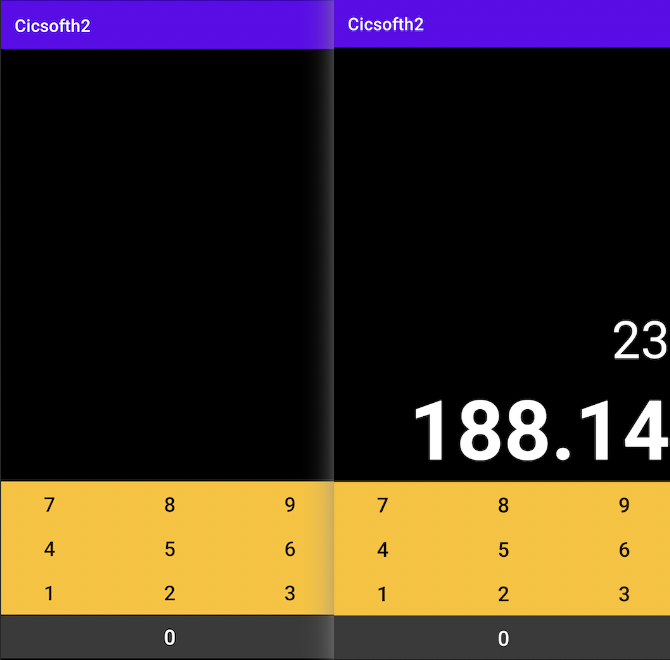

# cryptoConverter
It is a cryptocurrency converter built by Android Studio in Java.

## Instructions:
- Use the number pad to enter number (in US Dollar).
- Press Input area to undo number.
- The defualt crypto rate is 8.18 Crypto : 1 Dollar.

## Display:

